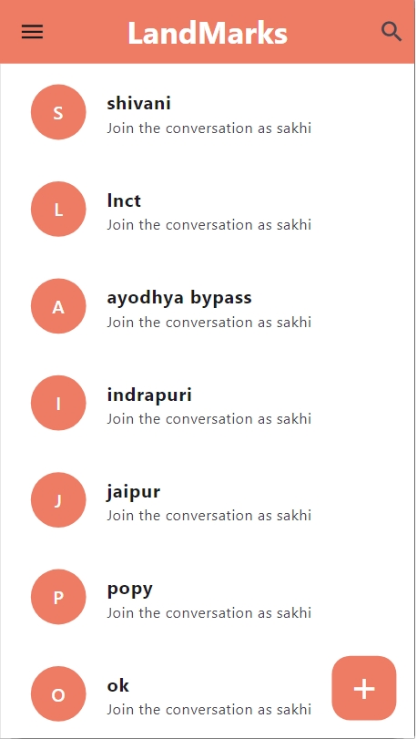
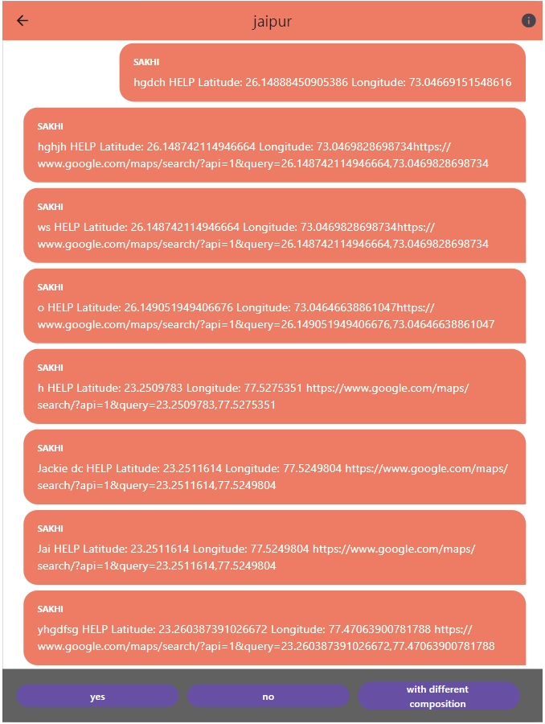
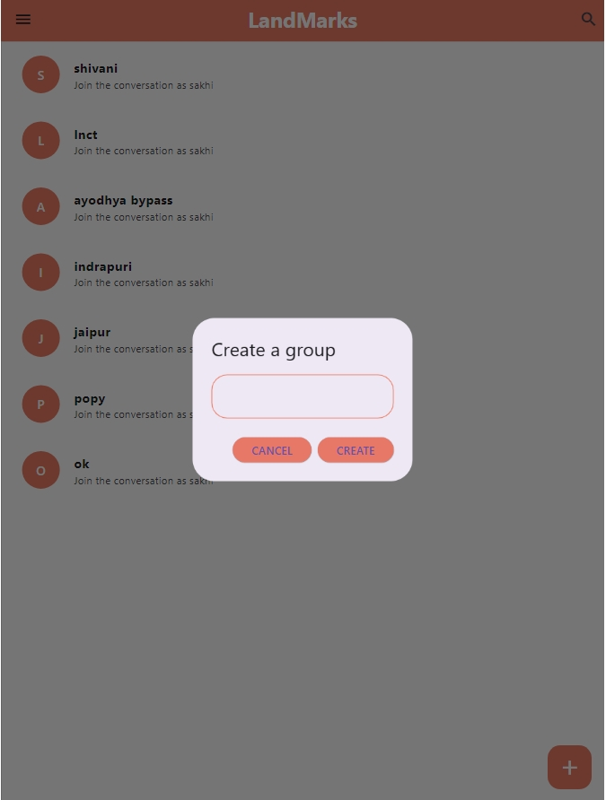

# Medi-Gaze

## Overview
Medi-Gaze is a medicine search app developed using Flutter and Dart. It empowers users to search for specific medicines by directly connecting with retailers of pharmacy stores. The app streamlines the process, eliminating the need for physically visiting multiple shops, thus saving users time and effort.

## Features
- **Medicine Search**: Users can search for specific medicines.
- **Retailer Connectivity**: Direct connection with retailers of pharmacy stores.
- **Time-Saving**: Eliminates the need for physically visiting multiple shops.
- **Firebase Integration**: Utilizes Firebase Authentication and Cloud Messaging services for secure user authentication and real-time notifications for order updates, delivery status, and other important information.

## Technologies Used
- **Flutter**: Framework for building natively compiled applications for mobile, web, and desktop from a single codebase.
- **Dart**: Programming language optimized for building Flutter apps.
- **Firebase**: Platform for building and managing mobile and web applications. Utilized for authentication and real-time notifications.

# ScreenShots

